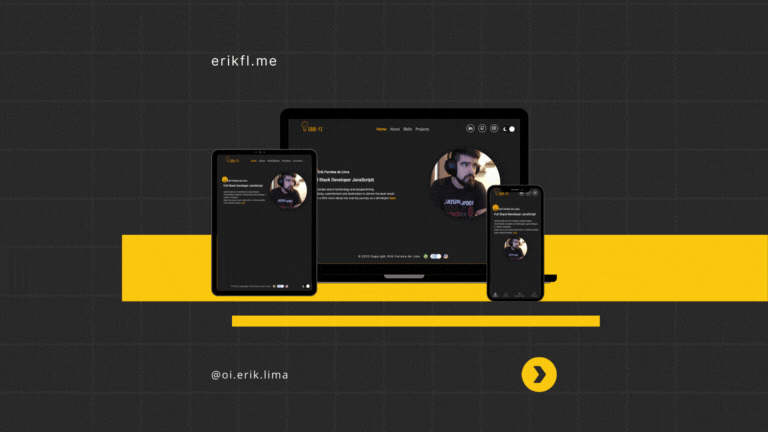

<h1 align="center"> ☀️ Portfolio 🔎</h1>

<div align="center" style=''>



</div>

## 📓 Sobre

O projeto foi desenvolvido com o intuito de mostrar meus projetos e habilidades.

<details>
  <summary>Sobre o desenvolvimento</summary>
  <br />

  Para o desenvolvimento do projeto, utilizei o framework ReactJS, com o objetivo de praticar e aprender mais sobre a biblioteca. O projeto foi desenvolvido com o intuito de mostrar meus projetos e habilidades, além de ser um portfólio pessoal.
  Além do outras bibliotecas, como o React Router Dom, para a navegação entre as páginas, e o React Icons, para a utilização de ícones, styled-components, para a estilização dos componentes entre outras bibliotecas.

  <br />
</details>


  ### Habilidades utilizadas durante o desenvolvimento 💻

<details>
  <summary> 🦾 Habilidades</summary>
  <br />

  * Desenvolvimento de aplicações React
  * Desenvolvimento de portfólio
  * Desenvolvimento de aplicações responsivas
  * Desenvolvimento de aplicações com React Hooks
  * Desenvolvimento de aplicações com React Router
  * Metodologia ágil(Kanban)

  <br />
</details>

<details>
  <summary> 🖥️ Tecnologias</summary>
  <br />

  * React.js
    * Components Funcional
    * Hooks
    * React Router
  * HTML5
  * CSS3
  * JavaScript
  * Material-ui
  * Styled-components
  * Git
  * GitHub-pages
  * Vercel

  <br />
</details>

<details>
  <summary> 🖥️ Implementações futuras 🖥️</summary>
  <br />

  * Front-end
    * Aplicar atomic design
    * Criar easter eggs na página
    * Criar uma página de contato/ About me
    * Criar area de admin para verificar informações sobre acessos e ter um controle sobre as
      melhoras que possam ser feitas no site
    * Aplicar testes unitários
  * Back-end
    * Criar uma api para armazenar os dados dos projetos
    * Criar testes de integração
    * Criar testes E2E
    * Aplicar testes unitários

  <br />
</details>

  <br />

### 🤝 Colaboradores 💻

<br />
<table>
  <tr>
      <td align="center">
      <a href="https://github.com/erik-efl">
        <br>
        <sub>
          <b>Erik Lima</b>
        </sub>
      </a>
    </td>
  </tr>
</table>

<br />

##

## ⚙️ Status do Projeto 🛠️

  ```js
    let projeto {
      "status": "Em desenvolvimento"
    }
  ```
##

### ©️ Aviso de direitos autorais

</br>

Esse projeto foi desenvolvido para propósitos de aprendizagem e divulgação de meus projetos, todo o código e documentação são da autoria de [Erik-EFL](https://github.com/Erik-EFL) e os direitos pertencem exclusivamente a [Erik-EFL](https://github.com/Erik-EFL). É permitido baixar ou clonar o repositório para fins de estudo. Contudo, não é permitido publicar cópias totais ou parciais. Este aviso não cobre bibliotecas, dependências ou marcas, estas estão sujeitas a suas respectivas licenças.
